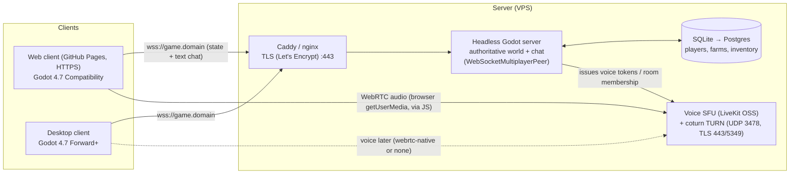

# Multiplayer Plan — Farm Prototype

*Status: plan only (no code yet). Written Oct 2026 against the v2 prototype (Godot 4.7.2, Web + desktop). Prices are approximate and were checked by web search in Oct 2026. Re-check them before buying.*

## 1. Goals

| Now | Later (roadmap only) |
| --- | --- |
| Each player has their own character and their own farm (later: farms they design and build themselves) | Player-chosen roles: mayor, police, emergency services |
| Text chat and voice chat between players | NPC townspeople bots that a newly joining player can take over |

## 2. Constraints that drive the design

- **Web client is static and single-threaded.** GitHub Pages only serves files, so all real-time logic needs a separate server. The web build has no threads and no GDExtension, so we can't load native plugins in the browser.
- **Browsers can't do raw UDP/ENet.** A browser can only use **WebSocket** (TCP) or **WebRTC** (UDP via ICE, which needs a signaling server plus STUN/TURN).
- **Pages is HTTPS, so the server must use `wss://`.** Browsers block plain `ws://` from an HTTPS page. That means a domain name and a TLS certificate (Let's Encrypt, auto-renewed with certbot or Caddy).
- **Players and the developer are in Iran.** This affects hosting accounts, payment, and network reliability (see §7).

## 3. Connection approach (recommendation)

| Option | Pros | Cons |
| --- | --- | --- |
| **WebSocketMultiplayerPeer** (Godot high-level multiplayer over `wss`) | Works in every browser and on desktop; one TCP port (443) passes most firewalls and filters; simple to deploy; the same server code serves web and desktop | TCP head-of-line blocking (a lost packet briefly stalls everything); slightly higher latency than UDP |
| **WebRTCMultiplayerPeer** | UDP-like unreliable channels, lower latency | Needs a signaling server *and* STUN/TURN; peer-to-peer meshes don't scale or stay authoritative; desktop needs the `webrtc-native` plugin; UDP is often throttled in Iran |

**Recommendation: one authoritative headless Godot server, connected by `WebSocketMultiplayerPeer` over `wss://game.<domain>`.** It carries game state and text chat. A farming game doesn't need twitch-level latency, so TCP is fine at 10–20 Hz. Voice runs on a **separate** channel (§5).

### Architecture

## 4. Game server design

**Authority model: server-authoritative.** Clients send *intents*: move input, "interact with tile X", "buy item Y", chat text. The server validates each intent, applies it, and broadcasts the results. Clients predict their own movement and smoothly correct it toward the server's answer; other players are interpolated about 100 ms behind.

| What syncs | Owner | How |
| --- | --- | --- |
| Player position, facing, locomotion speed, current action (pet, harvest…) | Server (from client input) | Unreliable-ordered snapshots at 10–15 Hz, quantized (about 20–30 bytes per player) |
| Animations | Derived on each client from speed and action | Not sent as frames; only the action id and a timestamp |
| Farm tile state (tilled, crop, growth, watered), sheep and other animals | Server | Reliable delta events ("tile 12 = tomato, growth 3") plus a full snapshot on join |
| **Time, season, weather** | **Server only** | `TimeManager` runs on the server; clients get `(day, minutes, speed, weather)` on join and every in-game hour, and extrapolate locally. Everyone shares one clock. Pause and speed become admin-only. |
| Money and inventory | Server | Reliable; the client is never trusted with prices |
| Text chat | Server relay | Reliable RPC, with rate limits and filtering |

The existing v2 code already fits this: `TimeManager`, `Economy` and `FarmPlot` are data-driven singletons with signals. The work is to run them on the server and make the client versions read-only mirrors.

**Interest management.**
- **M1:** one shared map (the farm and the town). Every client gets every player, since there are only 2–20 players.
- **M3:** **one shared town map with farm plots arranged around it** (a "farm district", each farm about 30×30 m). This is simpler than separate instanced farm scenes and keeps visiting easy. The server only sends a farm's tile updates to players within about 60 m of it (area-of-interest by distance or grid cell). Interiors and very large player-built farms can become separate instances later.

**Persistence.**
- **M3:** SQLite on the server, with tables `players`, `farms`, `tiles`, `inventory` and `world_state`. Autosave every in-game day and on disconnect.
- **Later:** move to Postgres when there is more than one server process or a need for backups and analytics. The JSON data file (`data/game_data.json`) remains the content source.

**Identity.**
- **M1:** guest name plus a random token kept in `localStorage`, so the same browser keeps the same player.
- **M3:** optional accounts (email magic link or username and password, hashed with argon2/bcrypt) through a small HTTPS endpoint on the same server.
- Names are unique, checked against a word filter, and limited to 3–16 characters.

## 5. Chat and voice

**Text chat (M1):** server-relayed RPC. Proximity "say" plus a global channel. Server-side rules:
- Max 200 characters per message.
- Rate limit: 5 messages per 10 s per player.
- Word filter, with chat logs kept for 30 days for reports.

**Voice: two options.**

| | A) Voice relayed over the game WebSocket | B) WebRTC voice via an SFU (recommended) |
| --- | --- | --- |
| How it works | Godot mic → `AudioEffectCapture` → encode → server → `AudioStreamGenerator` on other clients | The browser handles the mic with `getUserMedia`, Opus encoding, echo cancellation and noise suppression. The game calls a small JS layer through `JavaScriptBridge`. An SFU (LiveKit) forwards audio. |
| Codec | Godot has no built-in Opus encoder, and the web build can't load GDExtension. That leaves raw or 8-bit PCM: about 128–256 kbps per speaker. | Opus about 24–32 kbps per speaker |
| Quality | No echo cancellation; TCP stalls cause dropouts; encoding on the **single main thread** competes with rendering | Browser-grade audio processing, jitter buffers, UDP (falls back to TURN over TLS 443) |
| Server | No extra service | LiveKit OSS + coturn on the same VPS (or LiveKit Cloud) |
| Verdict | OK only for a quick push-to-talk test | **Use for M2** |

**Proximity voice:** the game sends player positions to JS, and JS sets each remote participant's volume by distance. The game server issues LiveKit join tokens (one room per map region), so only logged-in players can join.

**Desktop builds:** browser JS isn't available there. Options are the `webrtc-native` GDExtension with a LiveKit-compatible client (uncertain, needs a spike), or text-only chat on desktop at first.

**Moderation:**
- Per-user mute (client-side) and report (server stores context).
- Admin kick, mute and ban (by token, account and IP).
- Rate limits on chat, joins and RPCs.
- Voice is push-to-talk by default; the server can revoke a voice token instantly.
- Minimum-age note and terms in the page footer.
- Voice is not recorded, which avoids storing personal data.

## 6. Security

- The server validates every intent: distance to the tile or NPC, ownership, money, and cooldowns. Packet sizes are capped and rate-limited per peer, and peers that send malformed RPCs are dropped.
- Only `wss` with HSTS. Tokens are random 128-bit values and never shown in chat. No secrets go in the web build: LiveKit API keys stay on the server, and clients get short-lived tokens.
- The firewall only opens 443 (wss and TURN-TLS), 3478 UDP/TCP (TURN), the SFU UDP range and SSH (key-only).
- Automatic OS updates, nightly database backup to off-server storage, and the server process runs as a non-root systemd service that restarts on failure.

## 7. Hosting

**Bandwidth estimate.** A state snapshot is about 25 B per player at 12 Hz.
- With 20 players online, each client receives about 19 × 25 × 12 ≈ **6 KB/s (≈ 50 kbps)**. Server egress is about **1 Mbps**.
- At 4 hours per day that is roughly **50 GB/month**.
- Voice through an SFU: 3 active speakers × 32 kbps × 20 listeners ≈ **2 Mbps** while talking.
- **A 2 vCPU / 2–4 GB VPS handles M1–M3 for dozens of players.** One headless Godot instance uses about 100–300 MB RAM.

| Provider / plan | Approx. price per month | Notes |
| --- | --- | --- |
| **Hetzner Cloud CX23** (2 vCPU, 4 GB, 40 GB, 20 TB traffic, EU) | **≈ €5.49 + IPv4 (~€0.5–1)**, after the June 2026 price rise | Best value in the EU. ⚠ Strict ID/payment verification; Iranian users widely report rejected or closed accounts. Its terms bar restricted countries. |
| **DigitalOcean** Basic droplet (1 vCPU, 1–2 GB) | **$6–12** | ⚠ Its terms explicitly prohibit use from comprehensively sanctioned regions, including Iran. Accounts can be terminated. |
| Vultr / Linode / Oracle Cloud (Always Free ARM) / Fly.io | $0–6 (not re-verified) | US companies: the same sanctions restrictions are likely. Not recommended for an Iran-based owner. |
| **ArvanCloud** cloud server (Iran and EU regions) | **≈ €6–11** (1 vCPU / 1–2 GB), metered download traffic beyond about 250 GB | Iranian company with in-house panel, API and Terraform. Accepts local payment. Has Iran and some European data centres (verify which regions a new account can use). |
| **ParsPack** VPS (Iran) | **≈ 690,000–785,000 Toman** (1 vCPU / 1–2 GB, 100 GB incoming traffic) | Iranian; Iran data centres only for the cheap tier. Foreign locations exist on other plans. |
| Iranserver and similar Iranian hosts | (not verified) | Reportedly offer VPS; check before relying on it. |
| **LiveKit Cloud** "Build" (voice SFU) | **$0**: 5,000 participant-minutes per month (hard cap), 100 concurrent | Easiest voice option, but it's a US company: account and payment from Iran are likely restricted, and traffic may be filtered. **Self-hosted LiveKit OSS + coturn on the same VPS** is the safer default. |

**Iran caveats.** These are honest, partly uncertain points.
- **Accounts and payment:** Western providers (US ones especially) commonly refuse or close accounts tied to Iran. Iranian bank cards don't work internationally. Using a VPN to sign up can itself trigger fraud flags. Don't build on an account that could disappear.
- **Network:** Iranian filtering and throttling often degrade or block UDP and WebRTC and some foreign IP ranges. Unannounced international slowdowns and shutdowns have happened. Mitigations:
  - Run everything over **TLS on port 443** (wss, plus TURN over TLS).
  - Avoid depending on third-party CDNs.
  - Keep voice optional, so the game still works with text chat only.
- **Where the players are:**
  - **Mostly in Iran → host in Iran** (ArvanCloud or ParsPack). Latency is low and it stays reachable during international disruptions. Downsides: foreign players get worse latency, and content is subject to local rules.
  - **Mixed or international → an EU VPS** (if an account can legitimately be kept) or an Iranian provider's EU region.
  - The game files themselves can stay on GitHub Pages, though github.io reachability from Iran can vary. Mirroring the static files on the game server's domain is a cheap fallback.
- **Domain and TLS:** a `.ir` domain (IRNIC) or any registrar that accepts the owner. Let's Encrypt works anywhere the domain resolves. Caddy automates it.

**Recommended start:** one Iranian VPS with 2 vCPU / 2–4 GB (ArvanCloud or ParsPack) running Caddy, the headless Godot server, SQLite, LiveKit OSS and coturn. That is **about €8–15 per month or the Toman equivalent**. Switch to or add an EU region if players are mostly abroad.

## 8. Milestones

Effort assumes one developer familiar with the codebase and is rough.

| # | Scope | Effort | Acceptance criteria |
| --- | --- | --- | --- |
| **M1: Shared world + text chat** | Headless server build (`--server`), `wss` behind Caddy, join screen (name), spawn and despawn players, position/action snapshots with interpolation, name labels over heads, chat box (Enter to type), server-owned clock/season/weather sent to clients, reconnect handling | **2–3 weeks** | Two people open the Pages link on different networks, enter names, and within 10 s see each other walking in the same farm and town with names overhead. Movement looks smooth (no visible teleporting at 150 ms ping). Chat messages arrive in under 1 s. Both screens show the same clock, season and weather (within 1 in-game minute). No console errors. 0 crashes in a 30-minute session. The server stays at 8 or fewer clients without lag. |
| **M2: Voice** | LiveKit OSS + coturn, JS bridge in the web template, push-to-talk key, mute/unmute, per-player mute, proximity volume, voice indicator over heads | **1.5–2 weeks** (+1 week spike for desktop voice) | Two web players hear each other with under 400 ms delay, including one player on mobile data and one behind a restrictive NAT (TURN over 443 works). Muting works both ways. Moving 30 m away fades the voice out. If voice fails, the game and text chat keep working. |
| **M3: Own farms + persistence** | Accounts (optional), farm-district map with an assigned plot per player, server-side FarmPlot/Economy per player, SQLite saves, visiting other farms (read-only unless invited), area-of-interest filtering | **3–5 weeks** | A player logs in, plants, logs out, logs in the next day and finds the crops grown according to the shared clock. Other players see that farm but can't change it. A server restart loses at most 1 in-game day. Cheating attempts (fake money, far-away tile edits) are rejected and logged. |
| **M4: Roles + NPC takeover** | NPC townspeople with schedules (server-side bots); roles (mayor, police, emergency services) with permissions and tools; a joining player can claim an NPC (keeps its name, home, relationships); admin tools | **6–10+ weeks** (design-heavy) | NPCs walk their routines when no human controls them. A new player can pick a free NPC and continues seamlessly. Roles grant only their permissions (e.g. mayor sets the market tax, police can issue a fine). Role abuse can be reported and revoked. |

## 9. Roadmap notes (beyond M4)

- **Player-designed farms:** a tile and building placement editor saved as data (a grid plus placed-object list), validated server-side.
- **Roles:** elections or appointment for mayor, duty shifts for police and emergency services, events (fires, lost animals) generated by the server for emergency roles. Needs strong moderation, since social roles invite griefing.
- **NPC takeover:** NPCs are the same `Player` scene driven by an AI "controller". A human joining swaps in a network controller, so no model or animation changes are needed. This fits the existing `CharacterVisual` split.
- **Scaling:** more than about 50 concurrent players → several world shards behind a lobby, Postgres, and a dedicated SFU host.

## 10. Open questions for Amin

1. Where will most players be: inside Iran, abroad, or mixed? This decides where to host.
2. Is a desktop build with voice needed, or is web-first enough for M2?
3. Rough player-count target for the first public test (5? 20? 100?).
4. Any age or content rules for chat (e.g. a school or family audience)?
